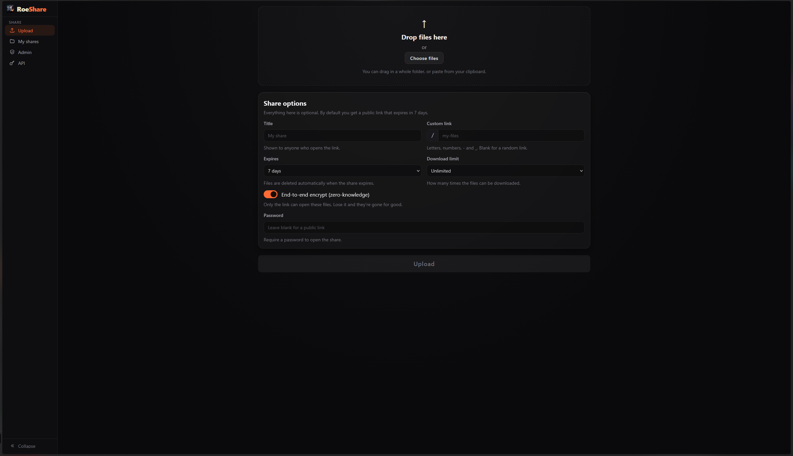

# RoeShare

[](LICENSE)
[](https://github.com/roe69/roeshare/actions/workflows/publish.yml)
[](https://hub.docker.com/r/roe69/roeshare)
[](https://hub.docker.com/r/roe69/roeshare)
[](https://bun.sh)
[](https://www.sqlite.org/)
[](https://claude.com/claude-code)

Self-hosted file sharing: drag files in, get an opaque share link, and
control who can fetch it and for how long. A single small container (Bun +
SQLite, zero npm dependencies).



- **Resumable chunked uploads.** Large files go up in chunks and continue from
  the last byte the server confirmed after a dropped connection or transient
  error. If the page is refreshed or reopened mid-upload, it offers to resume
  once you re-select the same files - including for end-to-end shares.
- **End-to-end encryption by default.** New shares are encrypted in your browser;
  the key lives in the link's `#fragment` and never reaches the server, which
  only ever stores ciphertext. Toggle it off for server-managed shares.
- **Encrypted at rest.** Server-managed (non-E2E) files are AES-256-GCM
  encrypted on disk by default in independently-authenticated chunks (tamper
  or corruption is detected, not silently decrypted), keyed from `SECRET`.
- **Per-share controls.** Password, expiry, download-count cap, one-time
  burn-after-download, and a custom link slug.
- **Paste to share.** Copy some text and paste it on the upload page (or type
  it into the note composer) to share it as a note - it's just a `.txt` file,
  so it gets the exact same controls, encryption, and preview as any upload.
- **In-browser preview.** Images, video, audio, PDFs, and text/code render
  inline (video and audio stream with seeking, even for E2E shares); download a
  whole share as one zip; a QR code for every link.
- **Admin panel.** Browse and manage shares, usage stats, an in-app settings
  editor, API keys (create, limit, rotate, revoke), and optional TOTP
  multi-factor login with one-time backup codes.
- **JSON API.** Per-key tokens with byte, expiry, and scope limits for
  programmatic uploads and managing that key's shares.

The name, colours, and icons are just defaults - rebrand it with a couple of
env vars, see [CUSTOMIZING.md](CUSTOMIZING.md).

## Quick start

Create a `docker-compose.yml`:

```yaml
services:
  roeshare:
    image: roe69/roeshare:latest
    container_name: roeshare
    restart: unless-stopped
    ports:
      - "3300:3300"
    environment:
      ADMIN_PASSWORD: replace-with-a-real-password # admin panel login - change this
      SECRET: "" # generate with `openssl rand -hex 32` - back it up!
      BASE_URL: http://localhost:3300 # public URL used in share links
    volumes:
      - roeshare-data:/data

volumes:
  roeshare-data:
```

Change `ADMIN_PASSWORD`, fill in `SECRET`, then:

```sh
docker compose up -d
```

Open http://localhost:3300 - the admin panel is at `/admin`. **Back up
`SECRET`**: it derives the at-rest encryption key, and losing it makes
encrypted uploads unrecoverable.

Without Compose, the same thing as one command:

```sh
docker run -d --name roeshare -p 3300:3300 -v roeshare-data:/data \
  -e ADMIN_PASSWORD=hunter2 -e SECRET=$(openssl rand -hex 32) \
  roe69/roeshare:latest
```

Uploads and the database persist in the `roeshare-data` volume either way.

## Configuration

Every setting is an env var - add them under `environment:`. All have sane
defaults except `ADMIN_PASSWORD` and `SECRET`, which you should always set.

| Variable         | Default                  | Description                                                                 |
| ---------------- | ------------------------ | --------------------------------------------------------------------------- |
| `HOST`           | `0.0.0.0`                | Network interface to bind.                                                   |
| `PORT`           | `3300`                   | Port to listen on.                                                          |
| `BASE_URL`       | `http://localhost:3300`  | Public base URL for share links and QR codes. No trailing slash. Comma-separate multiple domains for multi-domain serving (e.g. `https://share.example.com,https://files.example.com`); links are built from the visitor's domain, first entry is the canonical fallback. |
| `ADMIN_PASSWORD` | (empty)                  | Admin panel password. Required for admin access; if unset, admin is locked. A fixed set of well-known placeholder values (`change-me`, `changeme`, `change_me`, `admin`, `password`, `admin123`, `root`, `default`, `123456`) is rejected outright with a fatal error at boot - set a real password. |
| `SECRET`         | (ephemeral)              | Signs cookies/tokens and derives the at-rest encryption key. Required in production; if unset, an ephemeral one is generated and everything resets on restart. |
| `TRUSTED_PROXY_CIDRS` | (empty)             | Comma-separated CIDRs (e.g. `127.0.0.1/32,::1/128,10.20.0.0/24`) allowed to set X-Forwarded-For/X-Real-IP/X-Forwarded-Proto/X-Forwarded-Host. Only honored when the DIRECT connection comes from one of these; anything else falls back to the real socket peer. |
| `TRUSTED_PROXY_HOPS` | `1`                  | Number of trusted-proxy hops to skip from the right of X-Forwarded-For before taking the client address. Raise it if more than one trusted proxy is chained in front of RoeShare. |
| `TRUST_PROXY`    | `0`                      | Back-compat alias: `1` with `TRUSTED_PROXY_CIDRS` unset trusts loopback only (`127.0.0.1/32,::1/128`). Prefer setting `TRUSTED_PROXY_CIDRS` explicitly. |
| `DATA_DIR`       | `./data`                 | Directory holding the SQLite db and uploaded blobs.                         |
| `MAX_FILE_SIZE`  | `5368709120` (5 GiB)     | Max size of a single file, in bytes.                                        |
| `MAX_SHARE_SIZE` | `10737418240` (10 GiB)   | Max total size of one share, in bytes.                                      |
| `MAX_TOTAL_SIZE` | `0`                      | Total storage cap across all shares, in bytes. 0 = unlimited.              |
| `CHUNK_SIZE`     | `8388608` (8 MiB)        | Upload chunk size advertised to clients, in bytes.                         |
| `MAX_FILES_PER_SHARE` | `10000`             | Max number of files in a single share.                                      |
| `MAX_PASSWORD_LENGTH` | `1024`              | Max length of a share/upload password, in characters (bounds argon2 cost).  |
| `UPLOAD_BYTES_PER_SEC` | `52428800` (50 MiB/s) | Per-actor byte-rate budget for uploads (chunk PATCHes), in bytes/second. On top of the existing request-count/concurrency limits. 0 disables the byte-rate check. |
| `DOWNLOAD_BYTES_PER_SEC` | `52428800` (50 MiB/s) | Per-actor byte-rate budget for downloads/previews, in bytes/second. Same semantics as above. |
| `DEFAULT_KEY_MAX_SHARES` | `1000`            | Default lifetime share cap applied to a new API key when it isn't given an explicit `maxShares` limit. |
| `UPLOAD_PASSWORD`| (empty)                  | Require a password to create shares. Empty = open uploads.                  |
| `DEFAULT_EXPIRY` | `604800` (7 days)        | Default expiry for new shares, in seconds. 0 = never.                       |
| `DEFAULT_E2E`    | `1` (true)               | Whether new shares default to end-to-end encryption in the upload UI. 0 = default to server-managed shares. |
| `ENCRYPT_AT_REST`| `1` (true)               | Whether server-managed (non-E2E) blobs are AES-256-GCM encrypted at rest. 0 = store them as plaintext (no server crypto, lighter to serve). E2E shares are unaffected either way. |
| `APP_NAME`       | (coloured "RoeShare")    | Brand name and colours shown in the UI, e.g. `<col=5b9dff>Acme<b><col=34d27b>Drop</b>`. See [CUSTOMIZING.md](CUSTOMIZING.md). |
| `THEME_PRIMARY`  | (empty)                  | Hex colour (e.g. `#3b82f6`) for the primary/button accent. No CSS edit needed. |
| `THEME_ACCENT`   | (empty)                  | Hex colour (e.g. `#22c55e`) for links/highlights. No CSS edit needed.       |
| `X_ACCEL_REDIRECT`| (empty)                 | nginx internal `location` prefix for sendfile byte offload (advanced, optional). See [HTTPS](#https-reverse-proxy). |
| `X_SENDFILE`     | `0`                      | Set to `1` to use the Apache/Lighttpd `X-Sendfile` header for byte offload (advanced, optional). |
| `ABANDONED_UPLOAD_TTL` | `86400` (24 hours) | How long an upload that was never finalized is kept before the background sweep deletes it, in seconds. |
| `SWEEP_INTERVAL` | `3600` (1 hour)          | How often the background sweep deletes expired shares' files from disk, in seconds. Expiry itself is enforced at access time regardless. |

To keep secrets out of a compose file you commit or share, move them to a
`.env` next to it:

```yaml
    env_file:
      - .env
```

with `.env` holding `KEY=value` lines. Remove those keys from `environment:`
when you do - inline values always win over `env_file`.

Non-secret settings (`BASE_URL`, `TRUST_PROXY`, `APP_NAME`, the size/expiry/
limit knobs) can also be edited in the admin panel (Server section); edits
are saved to `settings.env` in the data volume and applied on the next
restart. The environment always wins: any key set in your compose file shows
as locked in the panel and cannot be changed or shadowed there - rotate
those where you set them. `ADMIN_PASSWORD`, `UPLOAD_PASSWORD`, and `SECRET`
are never panel-editable - always set (and rotated) via the environment or
`.env`, so a compromised admin session can't rotate or exfiltrate them.

## HTTPS (reverse proxy)

RoeShare speaks plain HTTP; TLS is up to whatever you already run in front of
it (a reverse proxy, a tunnel, nothing at all on a LAN). Two settings matter
when something proxies for it:

- `BASE_URL` - set it to the public https URL so share links and QR codes
  point at the right place.
- `TRUSTED_PROXY_CIDRS` - makes rate limiting and logs use the forwarded
  client IP, but ONLY for connections arriving directly from one of these
  CIDRs (e.g. `127.0.0.1/32,::1/128` for a proxy on the same host). A
  connection from anywhere else always uses the real socket peer, so the
  header can't be spoofed by the client. `TRUST_PROXY=1` remains as a
  shorthand for loopback-only trust if `TRUSTED_PROXY_CIDRS` is unset; when
  the app is exposed directly, leave both unset or clients can spoof their IP.

Ready-to-adapt configs, including the optional `X_ACCEL_REDIRECT` sendfile
offload for high-concurrency streaming, live in
[`deploy/nginx.example.conf`](deploy/nginx.example.conf) and
[`deploy/Caddyfile.example`](deploy/Caddyfile.example).

## Running from source

Only needed to modify RoeShare or build the image yourself:

```sh
git clone https://github.com/roe69/roeshare.git
cd roeshare
```

- **Docker**: edit `ADMIN_PASSWORD`/`SECRET` in the repo's `docker-compose.yml`
  (or put them in a gitignored `docker-compose.override.yml`), then
  `docker compose up -d --build`.
- **Bun directly** (>= 1.1, no build step):

  ```sh
  ADMIN_PASSWORD=hunter2 SECRET=<hex> bun run src/server.js
  ```

  Bun auto-loads a `.env` file from the working directory if you prefer a
  file. For a service, use a systemd unit with `Restart=always` (the admin
  panel's Restart button exits cleanly, so `on-failure` won't relaunch it)
  and `Environment=`/`EnvironmentFile=` for config.
- **Single binary**: `bun build --compile src/server.js --outfile roeshare`,
  then ship the binary next to the `public/` directory.

`GET /health` is a minimal, unauthenticated liveness probe (fixed `204 No
Content`, no body) for load balancers and the container healthcheck - it
deliberately discloses no uptime/version/internal state. [DEPLOY.md](DEPLOY.md)
has an optional GitHub Actions setup that publishes the image and redeploys a
server on every push.

## API

Everything the UI does is a JSON API under `/api` - shares, chunked uploads,
downloads, admin - documented in [CONTRACT.md](CONTRACT.md).

For scripts and other servers, create an API key in the admin panel and
upload with one request:

```sh
curl -X POST "https://share.example.com/api/v1/upload?title=Report" \
  -H "Authorization: Bearer rsk_xxx_yyy" \
  -H "X-Filename: report.pdf" \
  --data-binary @report.pdf
# -> { "id": "...", "url": "https://share.example.com/...", ... }
```

Keys can be scoped (size caps, max lifetime, slug/password permissions) and
revoked; large files can use the resumable chunked flow; a key can list,
download, and delete its own shares - enough to drive an external backup.
The admin panel's API docs page documents every endpoint with copy-ready
examples, and key holders can manage their shares in the browser at `/api`.

## Security notes

- **At-rest encryption**: server-managed blobs are AES-256-GCM ciphertext in
  independently-authenticated chunks, decrypted (and verified) only in memory
  per authorized request - tampering or corruption on disk is detected and
  refused, not silently decrypted. Every subkey (at-rest encryption, token
  signing, credential tagging) is derived from `SECRET` via HKDF with its own
  label, so they're cryptographically independent even though they share one
  root secret. Files encrypted before this format existed keep decrypting via
  the older AES-256-CTR path (confidentiality only, no per-chunk integrity)
  rather than being re-encrypted.
- **End-to-end shares** are encrypted in the browser; the server stores
  ciphertext it cannot read. New shares default to E2E.
- Random share/file ids and tokens are unguessable; custom slugs are
  user-chosen, so password-protect anything sensitive behind one.
- Share passwords are argon2-hashed and verified in constant time; admin
  cookies and access tokens are HMAC-signed with a `SECRET`-derived subkey.
- **Optional admin MFA**: enable TOTP (any standard authenticator app) in the
  admin panel for a second factor on top of the password, with one-time
  backup codes for device loss. Once enabled, a password alone only opens a
  short-lived intermediate session - the real admin cookie isn't issued until
  the second factor also verifies, and disabling MFA itself requires both the
  password and a valid code.
- Per-IP rate limiting on admin login, password unlock, and share creation.
- Uploaded names are sanitized and blobs stored under generated ids - no
  client-controlled paths; size caps are enforced against actual bytes.
- Run behind HTTPS in production; the admin cookie is marked `Secure`
  automatically when `BASE_URL` is `https`.
